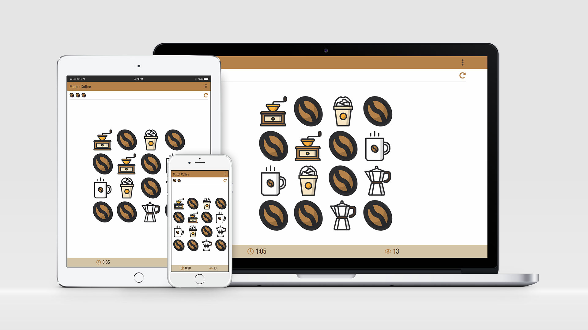

<h1 align='center'>Match Coffee</h1>

### A matching game for coffee lovers!

Match all cards as soon as possible, and with minimum moves.

You lose a bean every 30 secondes, after 12 moves, and after 20 moves.

---

## User stories

- Player can create account with email and password.
- Player can login / log out / delete account.
- Player can restart game.
- Player's (not logged-in) score of current game will be added after login or sign up.
- Player can see leaderboard of top 20 players.

---

## Credits

- Cards (Coffee Icon Pack) by [AomAm](https://iconscout.com/icon-pack/coffee-3)
- Icons by [Font Awesome](https://fontawesome.com/icons?m=free).

Built with [Preact](https://preactjs.com/) (No-build) & [Firebase](https://firebase.google.com/).
